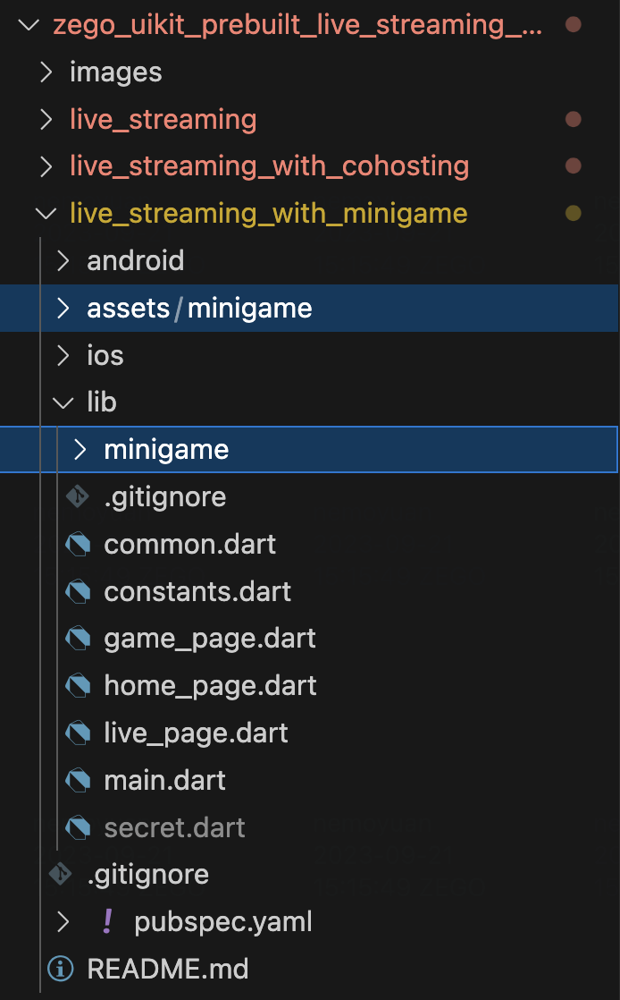

# Preface

## Principle of integrating MiniGame with Flutter

Our MiniGameEngine is based on web JS SDK. The Flutter solution relies on the flutter_inappwebview plugin to achieve interaction with JS and HTML. 

Our demo has currently completed the basic integration process examples, including HTML coding, Dart and HTML interaction encapsulation, etc. If you need to implement more game features, you will need to refer to the implementation method in the demo and expand it yourself. This may require you to read the demo code to understand the interaction between JS, HTML, and Dart.

## Disclaimer and Risks of Demo Code Usage

Dear user,

Before you proceed with this code, we urge you to read the following disclaimer thoroughly. This code is purely for reference and learning. Please be aware that any risks arising from the use of this code lie solely with the user. The author will not be held accountable for any loss or risk incurred.

The potential security risks include:
- The code may contain vulnerabilities or errors.
- System malfunctions or data loss might occur.
- The code may depend on third-party libraries or services.
- Some portions of the code should be used for teaching and demonstration only.

Users should:
- Be prepared for the security risks and take necessary measures to safeguard their systems and data.
- Backup data to avoid potential data loss.
- Evaluate the security and reliability of any third-party dependencies.
- Handle sample or demonstration code with caution, not using them in production environments.

Please ensure you fully comprehend and accept all risks and disclaimers before using this code. The author will not be accountable for any issues that arise from the use of this code. If you disagree with any part of this disclaimer, please refrain from using the code.

# Quick Start

## Download demo and test it.

1. Download Demo: [Client Demo\|_blank](https://github.com/ZEGOCLOUD/zego_uikit_prebuilt_live_streaming_example_flutter/tree/master/live_streaming_with_minigame), [Server Demo\|_blank](https://storage.zego.im/ZegoMiniGameSDK/server/ZegoMiniGameServerDemo.zip). 
2. Modify The Authentication Information: Please replace the appid, appsign, and server secret in [Client Demo\|_blank](https://github.com/ZEGOCLOUD/zego_uikit_prebuilt_live_streaming_example_flutter/tree/master/live_streaming_with_minigame) and Server Demo with those of your project.
3. Running the Server Demo,  then replace the [Client Demo\|_blank](https://github.com/ZEGOCLOUD/zego_uikit_prebuilt_live_streaming_example_flutter/tree/master/live_streaming_with_minigame)'s miniGameHostUrl with your own server url.
4. Then you can test ClientDemo (there are multiple demos in the [Client Demo\|_blank](https://github.com/ZEGOCLOUD/zego_uikit_prebuilt_live_streaming_example_flutter/tree/master/live_streaming_with_minigame) repository, please use live_streaming_with_minigame project).

## Integrated into your project

1. Copy the `./assets/minigame` and `./lib/minigame` folders from the Demo to your project.



2. Declare the newly added assets in your project's `pubspec.yaml` file.

```yaml
assets:
  - assets/minigame/index.js
  - assets/minigame/index.html
```

3. Execute the following command to add the following dependency libraries.

```bash
flutter pub add flutter_inappwebview dio encrypt
```

## Usage Instructions
### initialize the `ZegoMiniGame` SDK and render the mini-game UI.

#### init

After integrating `flutter_inappwebview`, you can use `InAppWebView` to render the mini-game UI and initialize the `ZegoMiniGame`. You can use `InAppWebView` anywhere you need it.

You can refer to [this part of the code\|_blank](https://github.com/ZEGOCLOUD/zego_uikit_prebuilt_live_streaming_example_flutter/blob/master/live_streaming_with_minigame/lib/live_page.dart#L67)

Please note that:

1. You need to call `ZegoMiniGame().initWebViewController(controller)` in the `onWebViewCreated` of `InAppWebView`.
2. You need to call `YourGameServer().getToken` and `ZegoMiniGame().initGameSDK()` in the `onWebViewCreated` of `InAppWebView`.

With these two steps, you can complete the initialization of `ZegoMiniGame` SDK.

#### Uninit the ZegoMiniGame SDK

When you no longer need the ZegoMiniGame SDK, you need to use `WillPopScope` to destroy the ZegoMiniGame SDK before exiting the page.

> Notice: This portion of code should not be placed in the `dispose` of widget. Because destroying the `ZegoMiniGame` SDK depends on `InAppWebView`, and when the widget is disposed, `InAppWebView` has already been destroyed.

```dart
Widget build(BuildContext context) {
  return WillPopScope(
    onWillPop: () async {
      await ZegoMiniGame().unloadGame();
      await ZegoMiniGame().uninitGameSDK();
      await ZegoMiniGame().uninitWebViewController();
      return true;
    },
    child: YourPage(),
  );
}
```

### Get game list

After ensuring the initialization of `ZegoMiniGame`, you can use `ZegoMiniGame().getAllGameList()` to get the game list and render it in the UI.

You can refer to [this part of the code\|_blank](https://github.com/ZEGOCLOUD/zego_uikit_prebuilt_live_streaming_example_flutter/blob/master/live_streaming_with_minigame/lib/minigame/show_game_list_view.dart#L31)


### User Currency

Please note that before starting the game:

1. You need to use `YourGameServer().exchangeUserCurrency` to exchange game coins for the user.
2. And use `YourGameServer().getUserCurrency` to query the current amount of game coins for the user.

You can refer to [this part of the code\|_blank](https://github.com/ZEGOCLOUD/zego_uikit_prebuilt_live_streaming_example_flutter/blob/master/live_streaming_with_minigame/lib/minigame/show_game_list_view.dart#L54C45-L54C45)


### start the game

After obtaining the game list, you can load the game by using `ZegoMiniGame().loadGame()`.

You can refer to [this part of the code\|_blank](https://github.com/ZEGOCLOUD/zego_uikit_prebuilt_live_streaming_example_flutter/blob/master/live_streaming_with_minigame/lib/minigame/show_game_list_view.dart#L54C45-L54C45)


